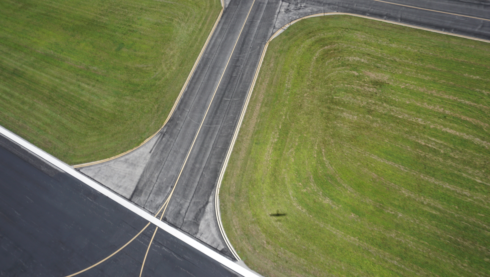
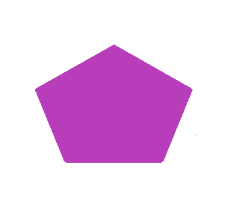

# Basic Image Manipulation

## Geometric Transformations  
PIL has predefined functions for the many image transformations we use to create our training dataset.
Another image transformation package is OpenCV which can do everything PIL does and more; however, we will stick with PIL because it is a smaller package.

In the following example we will walk through how we create our training data for our vision models. We will augment our artifical targets to and then paste them onto background images to make the data.

```python
from PIL import Image
img = Image.open("//path//to//comp_photo.jpg")
# Sanity Check
img.show('Example Image')
```



Now, we need to load in our artifical targets.
Enter this into your browser to download our fake targets or click [here](
https://bintray.com/uavaustin/target-finder-assets/download_file?file_path=base-shapes-v1.tar.gz).

```
https://bintray.com/uavaustin/target-finder-assets/download_file?file_path=base-shapes-v1.tar.gz
```

Let's open one of the target images.

```python
shape = Image.open("//path//to//shape.jpg")
# Sanity Check #2
shape.show('Example shape')
```


Since we have the background and shape images loaded, let's do some augmentation to the shape and then paste it onto the background image.
Let's start with rotation. PIL's rotation function will return a copy of this image, rotated the given number of degrees counter clockwise around its centre. The function takes three arguments: 

 - angle --  the degrees to rotate clockwise about the center

 - resample --  optional flag to choose which technique to use to interpolate new pixel values expand.

 - expand -- If 1, the image will expand to fit the newly rotated image.


```python 
rotated_img = image.rotate(angle, expand=1)
img.show("Rotated Image")
```


<details><summary>Solution</summary>
<p>

```python
img = img.rotate(180)

```

</p>
</details>

Let's make this image a little easier to see.
The function img.resize() takes in a tuple of (width, height) to resize an image to.
You can use this to squish or stretch an image, but in this case let's use it to double the size of our newly rotated image. 
_Hint: Don't forget, the input is a tuple._


<details><summary>Solution</summary>
<p>

```python
img = img.resize((120, 100))
```

</p>
</details>

Although we primarily use PIL for these steps, all of these operations can also be done in OpenCV.
We will not go through these steps a second time for OpenCV, but I will include the code at the end of this section for future reference.

