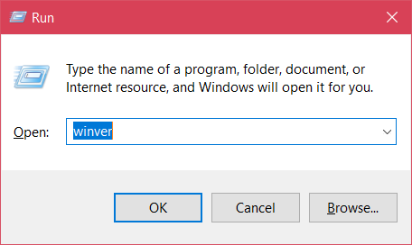
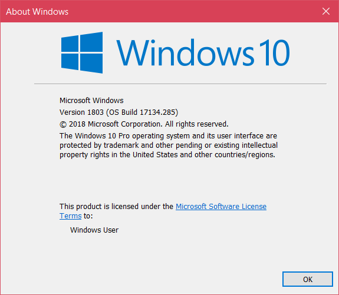
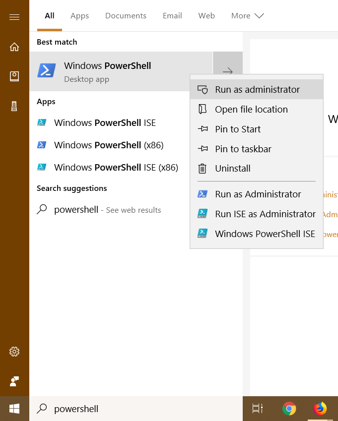
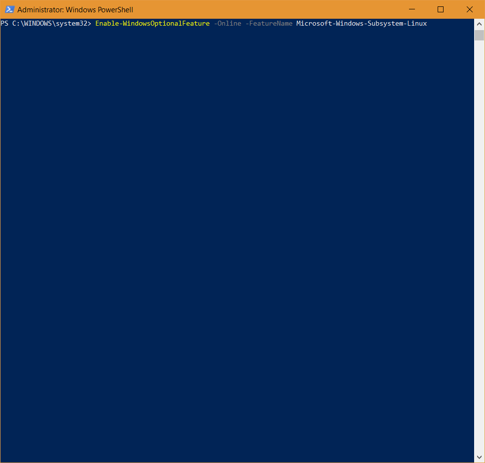
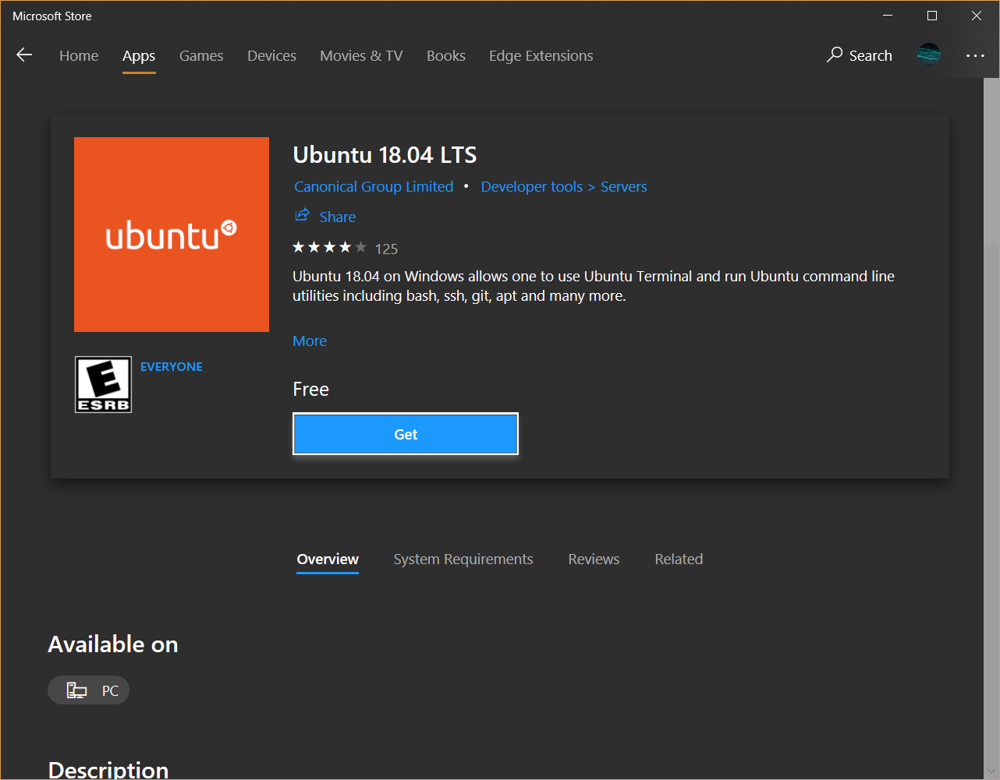
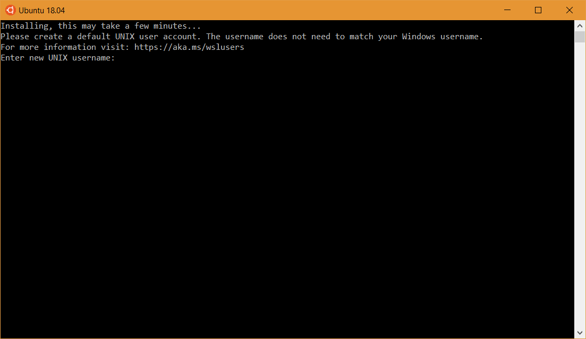
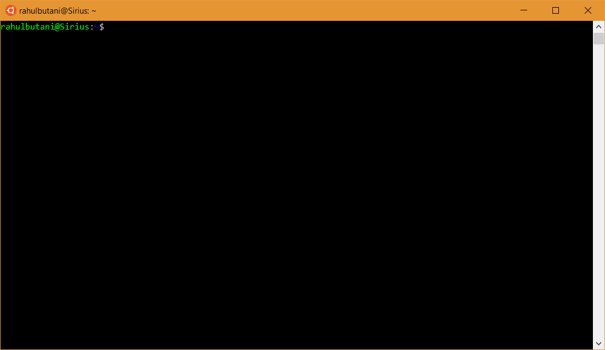

# Windows

If you're running Windows the first thing we need to do is make sure you're on a version that will work with the rest of our software. Any updated edition of Windows 10 will do; specifically, Version 1803 / Build 17134 (the April 2018 update) or newer.

## Check your Windows Version
Here's how you can check which version you're on. Press the Start Key + R to bring up the run command box; then type in `winver` and hit enter.



You should see something like this:



So long as your Windows Version is 1803 or greater, you're good to go. If it isn't check Windows Update; you probably have some updates you need to install.

## Linux + Windows -> WSL

Next, we can install the Windows Subsystem for Linux (WSL). This essentially allows you to have a UNIX-y development environment _without_ all of the fuss of dual-booting and virtualization. It's not _exactly_ like running Linux natively but it's [pretty](https://blogs.msdn.microsoft.com/commandline/2017/05/10/bashwsl-insiders-build-now-supports-usbserial-comms-and-mounting-removable-storage-network-shares/) [darn](https://docs.microsoft.com/en-us/windows/wsl/faq) [close](https://www.phoronix.com/scan.php?page=article&item=wsl-february-2018&num=6) (sidenote: there's some [very impressive engineering](https://blogs.msdn.microsoft.com/wsl/2016/05/23/pico-process-overview/) that goes into WSL, in case you're curious).

> _N.B.: In case these instructions don't work when you're reading this, they were sourced from [here](https://docs.microsoft.com/en-us/windows/wsl/install-win10)._

### Enable the Subsystem

First, we have to enable WSL. To do this, open PowerShell as Administrator:



And then, run:

```shell
> Enable-WindowsOptionalFeature -Online -FeatureName Microsoft-Windows-Subsystem-Linux
```



You may be asked to restart your computer. If you are, please do so.

## Installing a Linux Distribution:

Once we've enabled WSL, we can install a Linux distribution straight from the Windows Store! You have a fair number of options, but unless you know what you're doing, we recommend sticking with [Ubuntu 18.04](https://www.microsoft.com/store/productId/9N9TNGVNDL3Q).



Once it finishes installing, launch Ubuntu from the Start Menu and let it finish installing. If everything goes well, you should see something like this:



Pick any username and password that you can remember.

Finally, you should arrive at a prompt that looks something like this:



If so, WSL is up and running. Just to be sure, try running:

```shell
$ curl parrot.live
```

## Installing some essentials

Now that you've got WSL set up, it's time to start installing things inside the subsystem. Ubuntu (and several other distributions) use `apt`, a package manager, to install and manage software packages.

To start, let's tell `apt` to update the packages it knows about:

> N.B.: The `$` indicates that you should run a command in your terminal (Ubuntu's Bash in this case). I.e. copy and paste everything after the `$` into your terminal and hit enter. Right-click is paste. Astute readers will notice that above, a `>` was used as the prompt. This indicates that the command is meant to be run in cmd or PowerShell. If you're new to the command line, [here's](https://lifehacker.com/5633909/who-needs-a-mouse-learn-to-use-the-command-line-for-almost-anything) a good place to start.

```shell
$ sudo apt update
```

And then to install some handy tools:

```shell
$ sudo apt install clang cmake build-essential make
```

Press the 'Y' key and then enter if you're prompted to. This will probably some time, so here's a comic:

[](https://xkcd.com/149/)

(sudo lets you run commands as an administrator)

## Tweaking WSL

Next, let's change some WSL settings to make our lives a little easier. To do this, we're going to add things to our [`wsl.conf`](https://blogs.msdn.microsoft.com/commandline/2018/02/07/automatically-configuring-wsl/) file:

```shell
$ cat <<EOF | sudo tee --append /etc/wsl.conf
[automount]
enabled = true
root = /
options = "metadata,umask=22,fmask=11"
EOF
```

After that, just to be super sure that the changes take, restart your computer.

Once we've finished that, let's add a handy bash function to let us go from Windows paths to proper Unix paths:

```shell
$ cat <<EOF >> ~/.bashrc

function dos2wslPath
{
    if hash wslpath 2>/dev/null; then wslpath "\$*"; return $?; fi

    # Converts a Windows style path to something that we can access from bash
    # on windows.

    # Split on backslashes:
    IFS='\' read -ra DOS_PATH <<< "\$*"

    # Grab first letter of path, switch to lowercase using a bash 4 feature
    # (bash on windows is guaranteed bash 4.0+)
    DRIVE_LETTER="\${DOS_PATH[0]:0:1}"
    DRIVE_LETTER="\${DRIVE_LETTER,,}"

    # Pop one element
    DOS_PATH=("\${DOS_PATH[@]:1}")

    # Put together the new path:
    WSL_PATH="/\${DRIVE_LETTER}"
    for i in "\${DOS_PATH[@]}"; do
        WSL_PATH="\${WSL_PATH}/\${i}"
    done

    # Return:
    echo "\$WSL_PATH"
}
EOF
$ source ~/.bashrc
```

## Setting up the file system

The last thing we need to do is make it so that we can see WSL's files in Windows and vice-versa.

By default WSL lives in a sandbox and has its files hidden from Windows. However, WSL *can* access Windows' files. So, let's set things up so that we put our files where Windows can see them.

First, run this:

```shell
$ # b=$(a=$(powershell.exe 'echo $env:USERPROFILE'); echo $a | rev | cut -d\\ -f1 | rev | tr -d '\r'); c="/c/Users/$b/Documents"; [ -e "$c" ] && echo "home=\"$c\"" >> ~/.bashrc && echo "alias home='cd \"\${home}\"'" >> ~/.bashrc && source ~/.bashrc || echo "Something went wrong."

$ c=$(dos2wslPath $(a=$(powershell.exe 'echo $env:USERPROFILE'); echo $a | tr -d '\r')); [ -e "$c" ] && echo "home=\"$c/Documents\"" >> ~/.bashrc && echo "alias home='cd \"\${home}\"'" >> ~/.bashrc && source ~/.bashrc || echo "Something went wrong."

```

> Note: This may break on non-standard Windows installs; it has only been tested under the assumption that your user folder is in `C:\Users\`.

If the above runs successfully, you should now be able to type `home` anywhere to be taken back to your Windows' User Accounts' Documents folder.

Now, let's make it so that Ubuntu's Bash goes here everytime you open a new terminal:

```shell
$ echo "home" >> ~/.bashrc
```

Try it out! Open a new terminal window (hold down shift while clicking on the icon in the taskbar) and it should take you to your Documents folder.

You can customize which folder to use as your 'home' by editing your `~/.bashrc` file.

And, that's it! If you made it this far, congrats! 🎉
