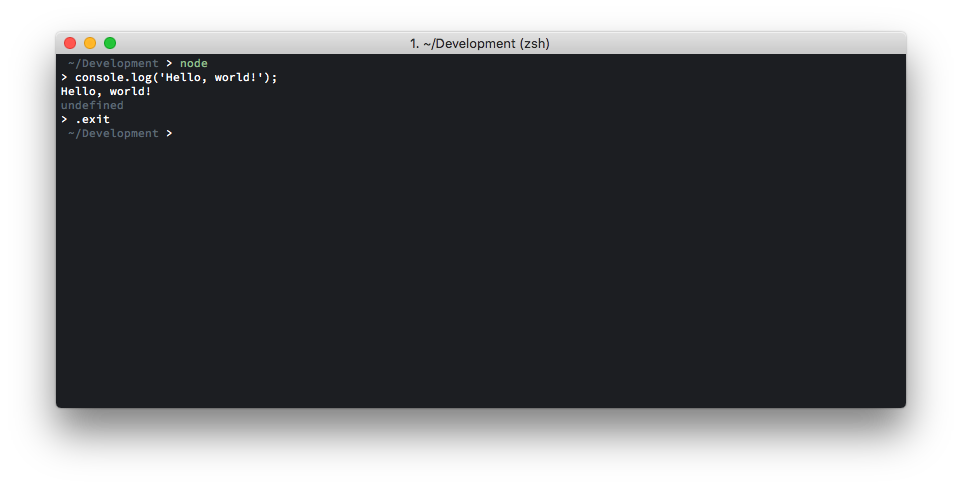
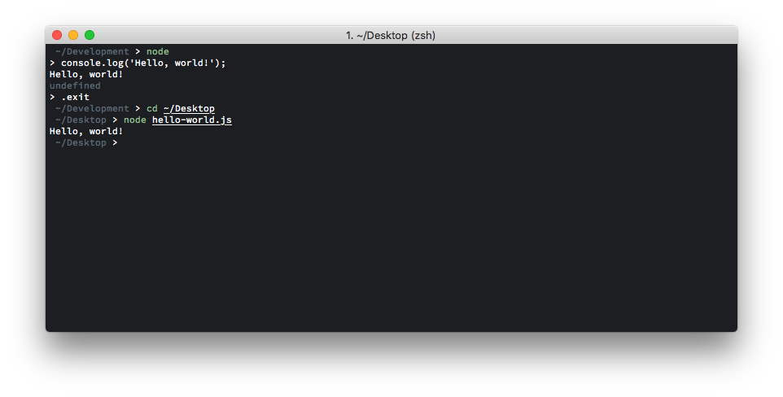

# Hello World

As is custom, we'll have to get a hello world example out of the way as a right
of passage.

We'll do it two different ways.

## Interactive Node.js

The easiest way to get started with Node.js is messing around in the
interactive command-line shell.

Go ahead and open a terminal and type in `node`. You should see a prompt come
up on the left. Anything you type here is evaluated in real time.

To print out `Hello, world!` go ahead and execute the following:

```js
console.log('Hello, world!');
```

To exit the shell, you can either press Control+C twice, or enter `.exit`.

Your output should look like the following:



We can see that `console.log(...)` is the print function for JavaScript.

## Running from a File

The more useful way to run this is to create a script and run it from the
command-line.

Create a file called `hello-world.js` with your favorite text editor. In my
case, I'll create it on my desktop so it is easy to find. The file contents
should read just as before:

```js
console.log('Hello, world!');
```

Navigate to the directory in your terminal that the file is in, and run
`node hello-world.js` to run the file.

The output should be the same:



> If you're not sure how to change directories to where the file is, you might
> want to read up on how to do basic terminal commands.
> [Here's an example article.](https://lifehacker.com/5633909/who-needs-a-mouse-learn-to-use-the-command-line-for-almost-anything)

Note that there is no compiling step here. It is simply interpreted by the
JavaScript engine.
