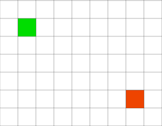

# Basic graph theory

This section covers the common definitions and ideas used in graph theory

## Definitions

**Graph**  
an ordered pair (V, E) where V is the set of nodes and E is the set of edges

**Undirected graph**  
a graph where the edge between two nodes are the same regardless of the direction.  I.E edge (x, y) is equivalent to (y, x)

**Directed graph**  
a graph where the the edge between two nodes are distinguish by their orientation

**Weighted graph**  
a graph where the edges have numerical weights indicating preference

**Connected graph**  
a connected graph is a graph where any node is reachable from every other node

**Cycle**  
a cycle in a graph means there exists a path that leads back to the starting point.  In undirected graph, a cycle must contains at least 3 nodes

**Acyclic graph**  
an acyclic graph contains no cycles

**Order**  
the order of a graph is denoted by |V| and represents the number of nodes

**Size**  
the size of a graph is denoted by |E| and represents the number of edges

**Tree**  
a tree is an acyclic connected undirected graph

**Rooted tree**
a tree where a node is indicated as the root node and all other nodes are define in relation to the root

**Leaf node**
a node in a rooted tree with no children

## Graph representation
A graph needs to be somehow represented in memory.  The main representations are adjacency list and adjacency matrix.

**Adjacency list**  
Each node keeps track of their connected neighbor and their weights.  Good for sparse graphs.

**Adjacency matrix**
A matrix keeps track of what whether an edge exists between two nodes.  Good for dense graphs.  Additionally, looking up if two nodes are connected takes constant time at the cost of taking up more space.

## Heuristics
To calculating the shortest path, we need to accurately estimate the distance between two nodes.  The common heustrics used for this purpose are Manhattan distance, Euclidean distance, and Diagonal distance.

  

**Manhattan distance** - the sum of horizontal and vertical offset between two points on a grid

\\( D = dx + dy \\)

Ex: \\( dx + dy = 6 + 4 = 10 \\)

**Euclidean distance** - the actual distance between two points on a grid using Pythagorean Theorem

\\( D = \sqrt{dx^2 + dy^2} \\)

Ex: \\( \sqrt{dx^2 + dy^2} = \sqrt{6^2 + 4^2} \approx 7.2 \\)

**Diagonal distance** - same as manhattan distance, but allows diagonal movements

\\( D = (dx + dy) + (C - 2) * min(dx, dy) \\), where C is cost of moving diagonally

if \\(C = 1\\), this is known as **Chebyshev distance**

Ex: \\( (dx + dy) + (C - 2) * min(dx, dy) = (4 + 6) + (1 - 2) * min(4, 6) = 6\\)

if \\(C = \sqrt{2}\\), this is known as **Octile distance**

Ex: \\( (dx + dy) + (C - 2) * min(dx, dy) = (4 + 6) + (\sqrt{2} - 2) * min(4, 6) \approx 7.7 \\)
