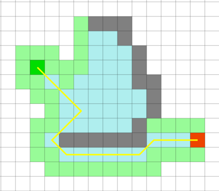

# Greedy Algorithm

Stems from depth first search.  Depth first search looks at a child of a node and follow it until it reaches the a leaf node, then follows another neighbor until all neighbors have been visited.  The greedy algorithm looks at all connected node and chooses the one closest to the target node based on a heuristic and navigate down that node.

# Pseudocode
```text
unmark all nodes
let S be a stack
S.push(start)
while S is not empty
  current_node = S.pop()
  if current_node is not marked:
    mark current_node as visited
    for all neighbor n of current_node
      n.parent = current_node
      n.cost = heuristic(n, end)
    end for
    order current_node.neighbors by cost and push to S
  end if
end while
```

# Problem
Fast, but can get stuck on obstacles and therefore not guaranteed to find shortest path.


