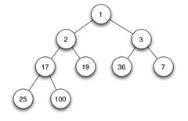

# Data structures

## Hash table
Hash table operates on the principle of a lookup table. Given an array of integers, you can make the integer themselves the index of the array and skip there to check if it exists.  For instance, given an array of unsigned integers [1, 3, 5], you can make an array of booleans with contents [false, true, false, true, false, true].  Then, checking if 1 is in the array is as simple as checking if array[1] is true.  With this, element look up can be done in constant time regardless of the size of the array.

However, if one was to insert 7 into the array, he would encounter an index out of bounds exception.  This can be remedied by a hash function, which essentially converts a number down to the length of the array.  Additionally, instead of having booleans as values, linked lists would be used instead. An extremely simple hash function in this case could be `n mod 6`, which would group 7 under array[1].  It can then be looked up in the linked list.

## Binary heap
A binary heap is a special case of a complete binary tree.  There's many types of binary heap, but the most common ones are min heap and max heap.  In a min heap, the children of a node is always greater than the value of the node.  A max heap is similar except the children is always less than the its parent.  Through this structure, the root of the heap is always the minimum (maximum) of the tree and can be retrieved quickly.

# Implementation Details
All obstacles are stored in a hashset such that a node can be looked up in constant time.  Through this, while navigating through the grid, pathfinder can simply check if a node is in the obstalce list to see if the node is accessible.  All nodes that have been evaluated are stored in the `close_list` hashset while all nodes that are yet to be evaluated but have been discovered are stored in the `open_list` hashset.  Nodes in `open_list` are also stored in a binary heap named `open_heap` to retrieve the node with the minimum cost in \\(O(log n)\\) time.

To generate waypoints from the path found, we take advantage of the fact that the shortest path will always border an obstacle, and mark nodes bordering such an obstacle, or critical nodes.  Then, the critical nodes can be aggregated to generate the waypoints.

# Influencing the path
The generated path can be influenced with additional modifiers in the cost function.  For instance, by taking the cross product of the vector from start node to end node with the heading vector between the current node and its neighbor, we can add the result to the cost heuristic.  Since the cross product between two parallel vectors is zero, this would cause the algorithm to favor direct paths over round about ones.
