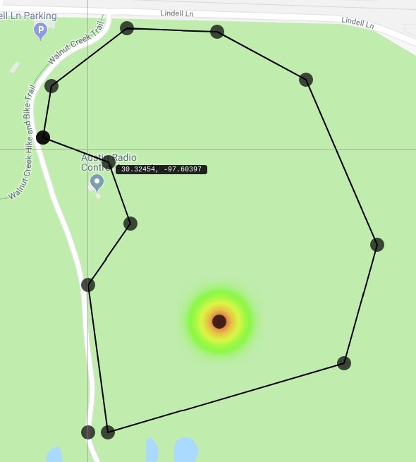

# Map Representation
Real world locations are in latitude and longitude, but A* has to operate on a graph which requires converting the map to a grid.

Since the plane can never be outside of the flyzone, we leverage this fact to find the lowest latitude and longitude of the flyzone and set that as the origin of the grid.  Henceforth, all points can be converted to a node by calculating the horizontal distance and vertical distance using the haversine formula, a formula that determines the great-circle distance between two points on a sphere.  Then, dividing the distance by the preset grid size will grant us the coordinate of the corresponding node.

To keep track of obstacles, we keep a hashmap of nodes which can be looked up in constant time.  Since all obstacles are circular, we calculate the perimeter nodes and add them to the obstacle list.  Flyzones are treated as obstacles as well and can be represented by generating lines between points and adding nodes along said lines to the obstacle list.

